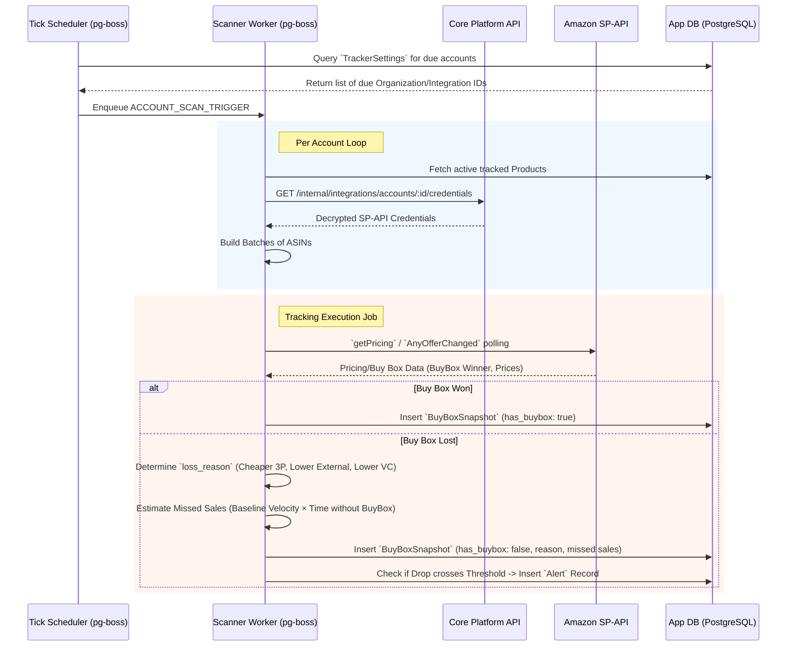
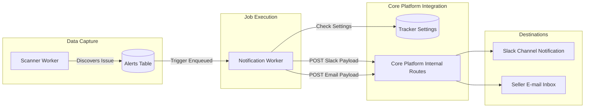
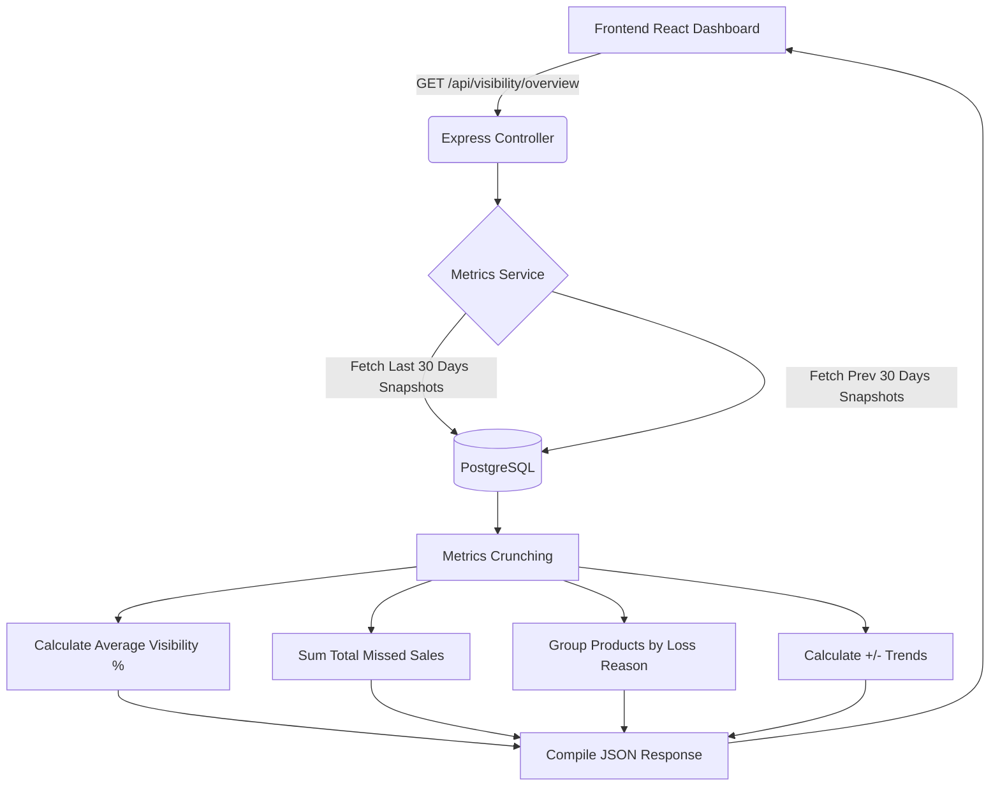

# Buy Box Tracker System Flow Diagrams

This document contains detailed flowcharts tracing the entire logic from data ingestion to alerting, to be utilized for understanding the integration between components.

## Buy Box Polling & Calculation Flow

## Alert Notification Routing

## Missed Sales Aggregation Flow (UI Dashboard)

