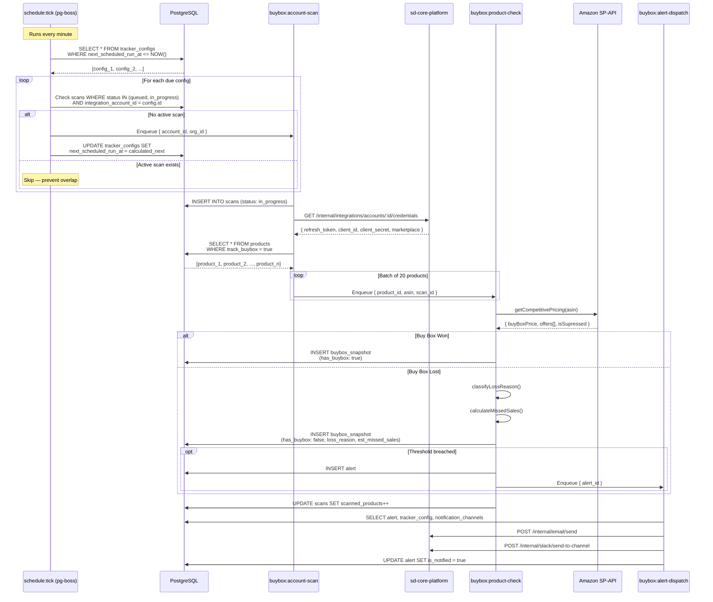
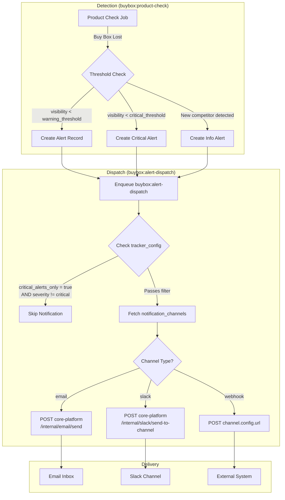
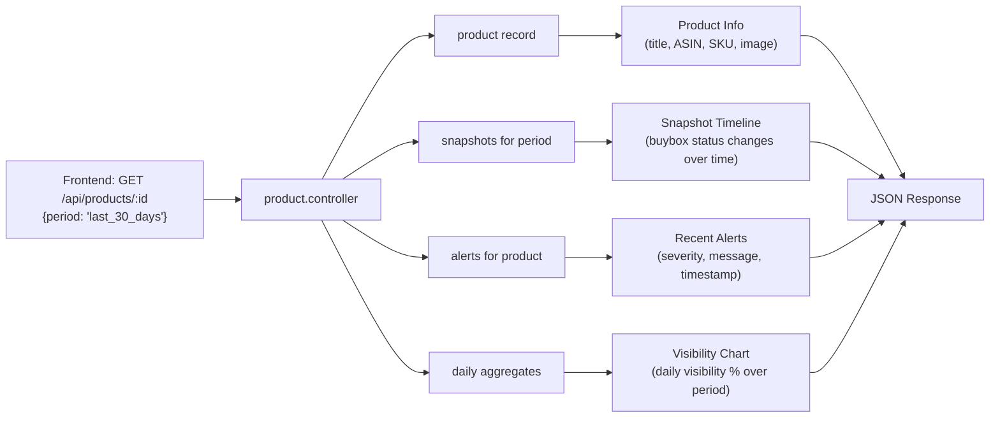
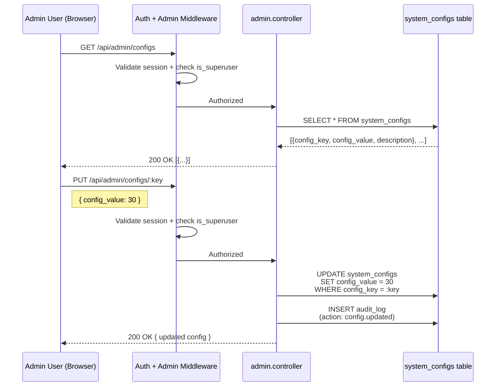
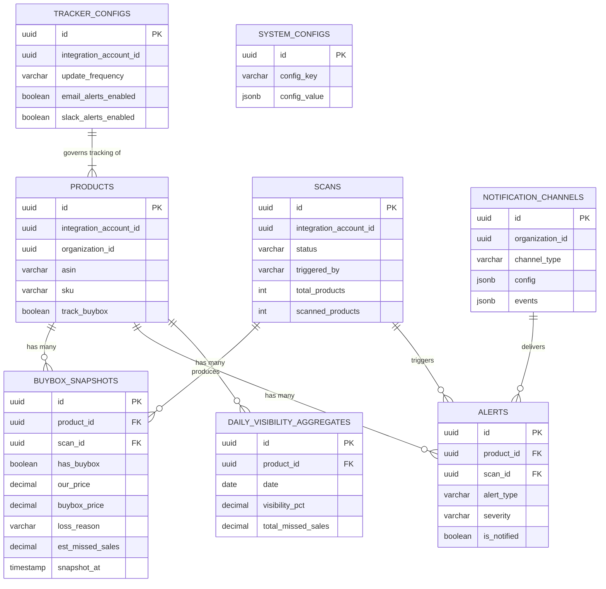

# Buy Box Tracker — System Flow Diagrams

Paste these Mermaid diagrams into any Mermaid-compatible renderer (GitHub, Notion, Mermaid Live Editor, etc.).

---

## 1. End-to-End Scan Lifecycle (Sequence Diagram)



---

## 2. Alert Notification Flow



---

## 3. Dashboard Data Flow (API Request)

```mermaid
flowchart TD
    A["Frontend: GET /api/visibility/overview<br/>{period: 'last_30_days', account_id}"] --> B[Auth Middleware]
    B -->|Validate session_id cookie| CP[core-platform /auth/me]
    CP -->|User + org data| B
    B --> C[visibility.controller]

    C --> D[metrics.service.getOverview]

    D --> E[(daily_visibility_aggregates)]
    D --> F[(buybox_snapshots)]
    D --> G[(scans)]

    E -->|AVG visibility_pct per day| H[visibility_trend: point[]]
    E -->|AVG across all products| I[avg_visibility: 49%]
    F -->|SUM est_missed_sales WHERE has_buybox=false| J[total_missed_sales: $8865]
    F -->|COUNT DISTINCT product_id WHERE has_buybox=false| K[products_affected: 6]
    F -->|GROUP BY loss_reason| L[loss_reasons: pie chart data]
    G -->|MAX completed_at| M[last_updated: 2h ago]

    subgraph "Trend Calculation"
        N[current_period metrics]
        O[previous_period metrics]
        N --> P["trend_pct = ((current - previous) / previous) × 100"]
        O --> P
    end

    H --> Q[Compile JSON Response]
    I --> Q
    J --> Q
    K --> Q
    L --> Q
    M --> Q
    P --> Q

    Q --> A
```

---

## 4. Product Detail Drill-Down



---

## 5. Admin System Config Flow



---

## 6. Entity Relationship Overview


