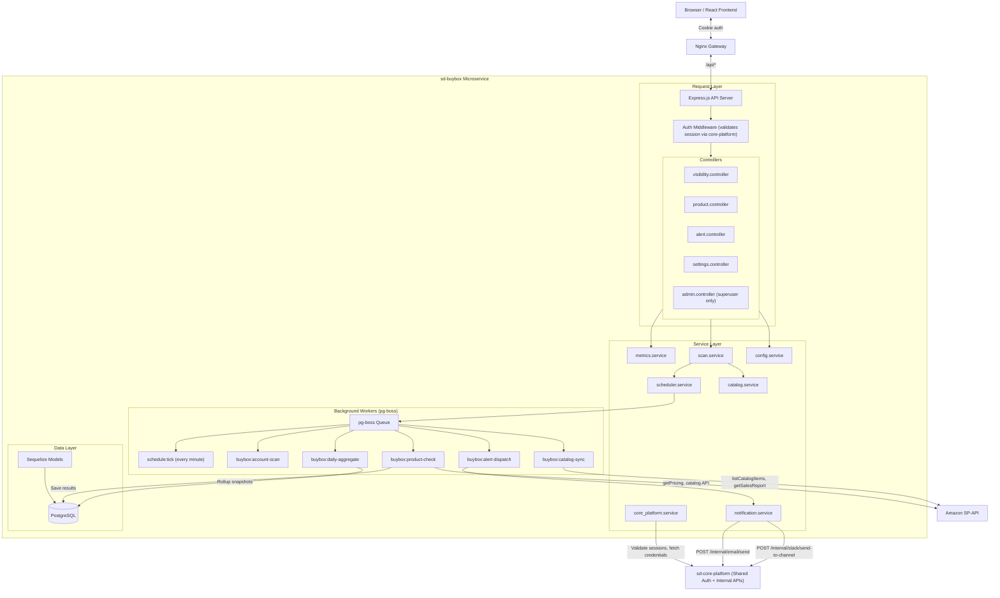

# System Architecture

## Overview
The Buy Box (Amazon Visibility) Tracker is a microservice tool that fits into the existing SaaS platform ecosystem. It follows the exact same architectural patterns as `sd-cohesity`: shared authentication via cookie-based sessions validated against `sd-core-platform`, internal service-to-service API calls for credentials/notifications, and `pg-boss` for background job processing.

## Tech Stack

| Layer | Technology | Notes |
|---|---|---|
| Language | TypeScript | Strict mode, same tsconfig as sd-cohesity |
| Runtime | Node.js 20+ | LTS version |
| Framework | Express.js | REST API |
| Database | PostgreSQL 15+ | Shared instance or dedicated, accessed via Sequelize |
| ORM | Sequelize v6 (TypeScript) | Paranoid deletes, underscored naming |
| Job Queue | pg-boss | PostgreSQL-backed, same DB |
| Auth | Cookie-based (session_id) | Validated against core-platform `/auth/me` |
| Containerization | Docker + docker-compose | Same pattern as sd-cohesity |
| Gateway | Nginx | Reverse proxy, same as sd-cohesity |

## Architecture Blueprint



## Directory Structure

```
sd-buybox/
├── backend/
│   ├── src/
│   │   ├── app.ts                           # Express app setup
│   │   ├── server.ts                        # Server bootstrap + pg-boss init
│   │   ├── config/
│   │   │   ├── database.ts                  # Sequelize connection
│   │   │   └── constants.ts                 # Job names, enums, etc.
│   │   ├── controllers/
│   │   │   ├── visibility.controller.ts     # Overview dashboard endpoints
│   │   │   ├── product.controller.ts        # Product list + detail endpoints
│   │   │   ├── alert.controller.ts          # Alert CRUD + mark-read
│   │   │   ├── settings.controller.ts       # TrackerConfig CRUD
│   │   │   └── admin.controller.ts          # SystemConfig management (admin-only)
│   │   ├── middlewares/
│   │   │   ├── auth.middleware.ts            # Cookie -> core-platform session validation
│   │   │   └── admin.middleware.ts           # Superuser check
│   │   ├── models/
│   │   │   ├── index.ts                     # Associations + re-exports
│   │   │   ├── product.ts
│   │   │   ├── buybox_snapshot.ts
│   │   │   ├── scan.ts
│   │   │   ├── alert.ts
│   │   │   ├── tracker_config.ts
│   │   │   ├── notification_channel.ts
│   │   │   ├── daily_visibility_aggregate.ts
│   │   │   ├── system_config.ts
│   │   │   └── audit_log.ts
│   │   ├── services/
│   │   │   ├── core_platform.service.ts     # Internal API client (credentials, email, slack)
│   │   │   ├── scan.service.ts              # Orchestrates scans
│   │   │   ├── buybox_checker.service.ts    # SP-API pricing check + classification
│   │   │   ├── metrics.service.ts           # Aggregation queries for dashboard
│   │   │   ├── scheduler.service.ts         # pg-boss tick + next-run calculation
│   │   │   ├── catalog.service.ts           # SP-API catalog sync
│   │   │   ├── config.service.ts            # SystemConfig read/write
│   │   │   ├── notification/
│   │   │   │   ├── notification.service.ts  # Dispatcher
│   │   │   │   ├── notification.interface.ts
│   │   │   │   ├── email.channel.ts         # Calls core-platform /internal/email/send
│   │   │   │   └── slack.channel.ts         # Calls core-platform /internal/slack/*
│   │   │   └── job_queue.service.ts         # pg-boss init/shutdown
│   │   ├── routes/
│   │   │   ├── index.ts
│   │   │   ├── visibility.routes.ts
│   │   │   ├── product.routes.ts
│   │   │   ├── alert.routes.ts
│   │   │   ├── settings.routes.ts
│   │   │   └── admin.routes.ts
│   │   ├── utils/
│   │   │   ├── logger.ts
│   │   │   ├── error.ts
│   │   │   └── sp_api.client.ts             # Amazon SP-API HTTP wrapper
│   │   └── types/
│   │       └── index.ts
│   ├── migrations/                          # Sequelize CLI migrations
│   ├── package.json
│   └── tsconfig.json
├── frontend/                                # React app (Vite)
├── gateway/                                 # Nginx config
├── docker-compose.yml
├── .env.example
├── Makefile
└── docs/
```

## Core Platform Integration Points

Our microservice communicates with `sd-core-platform` via two mechanisms:

### 1. User-Facing (Session-based)
For any request from the frontend, the auth middleware forwards the `session_id` cookie:
```
GET /auth/me  →  validates session, returns user + memberships
GET /integrations/accounts  →  list connected Amazon accounts
GET /billing/  →  check subscription status / plan tier
```

### 2. Service-to-Service (API Key-based)
For background workers that have no user session:
```
GET  /internal/integrations/accounts/{id}/credentials  →  decrypted SP-API tokens
POST /internal/email/send                              →  send transactional email
POST /internal/slack/send-to-channel                   →  send Slack notification
POST /internal/slack/send-to-user                      →  send Slack DM
POST /internal/usage/track                             →  track tool usage
POST /internal/audit-logs                              →  audit trail
GET  /internal/organizations/{id}/entitlements          →  check ASIN limits
POST /internal/organizations/{id}/entitlements/consume  →  consume ASIN quota
```

All service-to-service calls use:
```
Headers: X-Service-Key: {INTERNAL_API_KEY}, X-Service-Name: buybox
```

## Data Flow: End-to-End Scan Cycle

1. **Tick** — `schedule:tick` pg-boss job fires every minute, queries `tracker_configs` for accounts where `next_scheduled_run_at <= now`.
2. **Account Scan** — For each due account, enqueue `buybox:account-scan`. This checks for active scans (prevents overlap), fetches the product list, and fans out `buybox:product-check` jobs in batches.
3. **Product Check** — Each job fetches SP-API credentials from core-platform, calls `getCompetitivePricing`, classifies the result, calculates missed sales, and inserts a `buybox_snapshot`.
4. **Alert Generation** — If a product drops below the visibility threshold or a new competitor appears, an `alert` record is created and a `buybox:alert-dispatch` job is queued.
5. **Alert Dispatch** — The notification worker checks the org's notification channels and `tracker_config` preferences, then calls core-platform internal routes to send emails and/or Slack messages.
6. **Daily Aggregation** — A nightly `buybox:daily-aggregate` job rolls up the day's snapshots into `daily_visibility_aggregates` for fast dashboard queries.

## Admin Section

Admin routes are protected by a middleware that checks `is_superuser` on the user object returned from core-platform session validation.

**Admin capabilities:**
- CRUD on `system_configs` (change cron intervals, marketplace lists, thresholds)
- View all organizations' scan statuses (for debugging)
- Trigger manual scans for any account
- View system health (queue depth, failed jobs, last successful scan per account)
