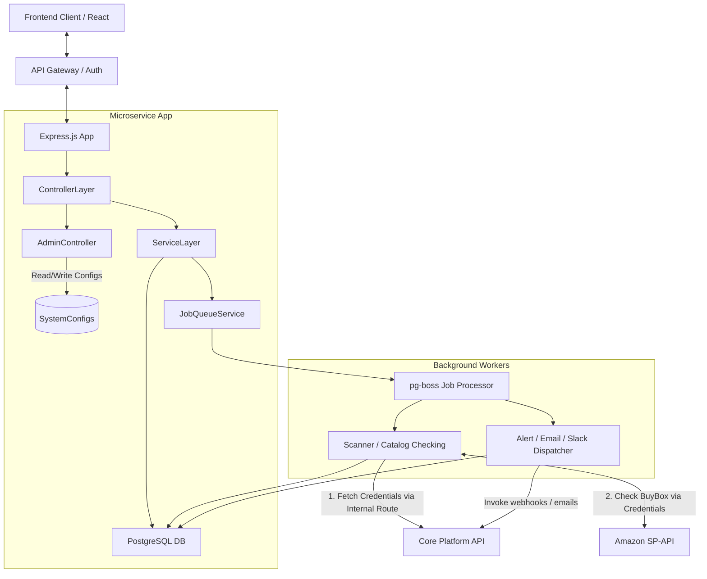

# System Architecture

## Overview
The Buy Box (Amazon Visibility) Tracker is built as a microservice tool functioning symmetrically to the rest of the SaaS ecosystem.

## Tech Stack
Based on `sd-cohesity`, the stack is built upon:
- **Language**: TypeScript
- **Backend Framework**: Node.js + Express
- **Database**: PostgreSQL
- **ORM**: Sequelize (Typescript-based)
- **Job Queue**: `pg-boss` (utilizes PostgreSQL as a queue broker)
- **Architecture**: Modular Services

## Architecture Blueprint

## Directory Structure
To mimic the existing ecosystem, the backend code will reside in a structured `./src` folder:
- `controllers/`: Handles incoming HTTP HTTP requests and responses (e.g., `visibility.controller.ts`, `admin.controller.ts`).
- `services/`: Business logic, metric calculators (`metrics.service.ts`), configuraton polling (`config.service.ts`), and Buy Box determination logic.
- `models/`: Sequelize model definitions (referencing `database_schema.md`, including `SystemConfig`).
- `jobs/` or `services/queue/`: Job queue registration and processors for `pg-boss`.
- `utils/`: Helpers for math calculations and Amazon API client wrappers.

## Data Flow for a Metric Check
1. Target User's `TrackerSettings` define `Hourly` scans.
2. `SchedulerService` (`pg-boss` tick function) identifies it's time for the account's scan.
3. Queue processes the Account ID, querying target active ASINs.
4. Worker checks ASIN Buy Box statuses over the SP-API/Scraping service.
5. Worker saves a `BuyBoxSnapshot`.
6. UI calls the Express API to fetch the Overview Dashboard data.
7. `MetricsService` sums the historical `BuyBoxSnapshots` and compares them to previous time windows.
8. API serves JSON response containing aggregated `MissedSales`, `VisibilityRatio`, etc.
