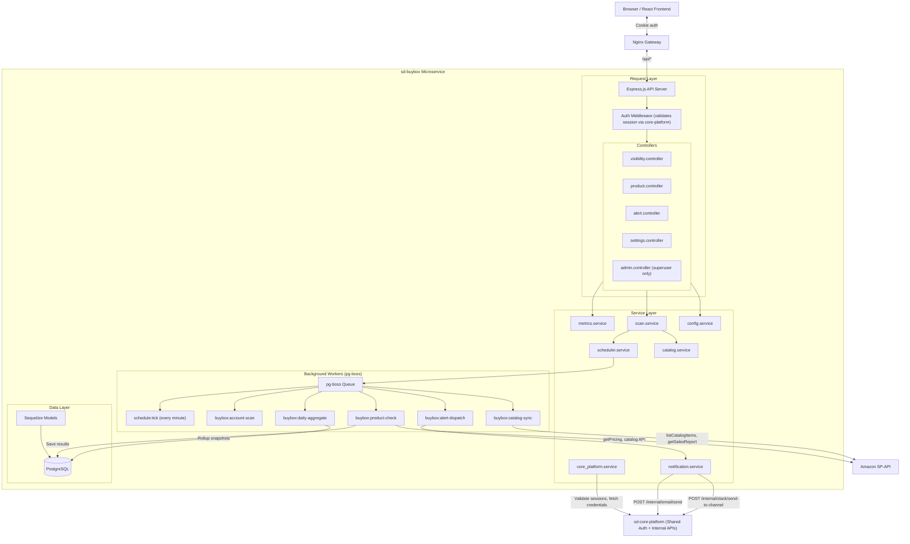

# System Architecture

## Overview
The Buy Box (Amazon Visibility) Tracker is a microservice tool that fits into the existing SaaS platform ecosystem. It follows the exact same architectural patterns as `sd-cohesity`: shared authentication via cookie-based sessions validated against `sd-core-platform`, internal service-to-service API calls for credentials/notifications, and `pg-boss` for background job processing.

## Tech Stack

| Layer | Technology | Notes |
|---|---|---|
| Language | TypeScript | Strict mode, same tsconfig as sd-cohesity |
| Runtime | Node.js 20+ | LTS version |
| Framework | Express.js | REST API |
| Database | PostgreSQL 15+ | Shared instance or dedicated, accessed via Sequelize |
| ORM | Sequelize v6 (TypeScript) | Paranoid deletes, underscored naming |
| Job Queue | pg-boss | PostgreSQL-backed, same DB |
| Auth | Cookie-based (session_id) | Validated against core-platform `/auth/me` |
| Containerization | Docker + docker-compose | Same pattern as sd-cohesity |
| Gateway | Nginx | Reverse proxy, same as sd-cohesity |

## Architecture Blueprint



## Directory Structure

```
sd-buybox/
├── backend/
│   ├── src/
│   │   ├── app.ts                              # Express app setup
│   │   ├── server.ts                           # Server bootstrap + pg-boss init
│   │   ├── config/
│   │   │   ├── env.ts                          # Env vars + fail-fast validation
│   │   │   ├── database.ts                     # Sequelize connection
│   │   │   └── constants.ts                    # Job names, enums, etc.
│   │   ├── controllers/
│   │   │   ├── visibility.controller.ts        # Overview dashboard endpoints
│   │   │   ├── product.controller.ts           # Product list + detail endpoints
│   │   │   ├── alert.controller.ts             # Alert CRUD + mark-read
│   │   │   ├── scan.controller.ts              # Manual scan trigger / list / detail
│   │   │   ├── settings.controller.ts          # TrackerConfig CRUD (entitlement-clamped)
│   │   │   ├── entitlements.controller.ts      # GET /me, POST /refresh
│   │   │   ├── integrations.controller.ts      # Proxy to core-platform integrations
│   │   │   └── admin.controller.ts             # SystemConfig management (admin-only)
│   │   ├── middlewares/
│   │   │   ├── auth.middleware.ts              # Cookie -> core-platform session validation
│   │   │   ├── entitlements.middleware.ts      # requireAnyEntitlement / requireFeature
│   │   │   ├── error.middleware.ts             # Error envelope normalisation
│   │   │   └── morgan.middleware.ts            # HTTP request logging
│   │   ├── models/
│   │   │   ├── index.ts                        # Associations + re-exports
│   │   │   ├── product.ts
│   │   │   ├── buybox_snapshot.ts
│   │   │   ├── scan.ts
│   │   │   ├── alert.ts
│   │   │   ├── tracker_config.ts
│   │   │   └── system_config.ts
│   │   ├── services/
│   │   │   ├── corePlatform.client.ts          # Sole HTTP client to sd-core-platform
│   │   │   ├── scan.service.ts                 # Orchestrates scans (stub)
│   │   │   ├── buybox_checker.service.ts       # SP-API pricing check (stub)
│   │   │   ├── metrics.service.ts              # Dashboard aggregations (stub)
│   │   │   ├── scheduler.service.ts            # pg-boss tick (stub)
│   │   │   ├── catalog.service.ts              # SP-API catalog sync (stub)
│   │   │   ├── notification.service.ts         # Alert dispatch (stub)
│   │   │   ├── config.service.ts               # SystemConfig read/write
│   │   │   ├── job_queue.service.ts            # pg-boss init/shutdown
│   │   │   └── entitlements/                   # Plan / feature / limit gating
│   │   │       ├── entitlements.types.ts       # Slug constants + types
│   │   │       ├── entitlements.service.ts     # snapshot / has / consume / clamp
│   │   │       └── index.ts                    # Barrel export
│   │   ├── routes/
│   │   │   ├── index.ts                        # Mounts unlockedOrgChain + orgChain
│   │   │   ├── auth.routes.ts
│   │   │   ├── visibility.routes.ts
│   │   │   ├── product.routes.ts
│   │   │   ├── alert.routes.ts
│   │   │   ├── scan.routes.ts
│   │   │   ├── settings.routes.ts
│   │   │   ├── entitlements.routes.ts
│   │   │   ├── integrations.routes.ts
│   │   │   └── admin.routes.ts
│   │   ├── utils/
│   │   │   ├── logger.ts
│   │   │   ├── handle_error.ts                 # apiSuccess / apiError envelope
│   │   │   ├── request_auth.ts                 # Typed accessors for req.auth
│   │   │   └── pagination.ts
│   │   └── types/
│   │       ├── corePlatform.ts                 # Shapes returned by sd-core-platform
│   │       └── express.d.ts                    # req.auth augmentation
│   ├── migrations/                             # Sequelize CLI migrations
│   ├── package.json
│   └── tsconfig.json
├── frontend/                                   # React app (Vite)
├── gateway/                                    # Nginx config
├── docker-compose.yml
├── .env.example
├── Makefile
└── docs/
    ├── entitlements.md                         # Feature contract + superuser setup
    ├── system_architecture.md                  # This file
    ├── database_schema.md
    └── ...
```

## Core Platform Integration Points

Our microservice communicates with `sd-core-platform` via two mechanisms,
both flowing through the single client at
[`src/services/corePlatform.client.ts`](../backend/src/services/corePlatform.client.ts).
No other file in buybox imports `axios` for core-platform URLs.

### 1. User-Facing (Session-based)
For any request from the frontend, the auth middleware forwards the `session_id` cookie:
```
GET /auth/me                                                 →  validates session, returns user + memberships
POST /auth/logout                                            →  clear session
```

### 2. Service-to-Service (API Key-based)
Internal endpoints are reached with `X-Service-Key: {INTERNAL_API_KEY}`
and `X-Service-Name: buybox` headers, injected automatically by the
client's request interceptor on any `/internal/*` path:

```
GET  /internal/integrations/accounts                         →  list connected SP-API accounts for an org
POST /internal/email/send                                    →  send transactional email
POST /internal/slack/send-to-channel                         →  send Slack notification
POST /internal/audit-logs                                    →  audit trail
GET  /internal/organizations/{id}/entitlements               →  list active feature limits for an org
POST /internal/organizations/{id}/entitlements/consume       →  atomic check-and-increment of a flow limit
```

## Entitlements & Plan Gating

Plan / feature / limit enforcement is delegated entirely to sd-core-platform.
Buybox owns **zero** plan or pricing data — a superuser configures features
and plans via the core-platform admin UI, and buybox reads them at runtime.

The **single read path** is [`entitlements.service.ts`](../backend/src/services/entitlements/entitlements.service.ts):

```ts
import { entitlements, FEATURE, LIMIT } from '../services/entitlements';

const snapshot = await entitlements.snapshot(orgId);

entitlements.has(snapshot, FEATURE.SLACK_ALERTS);              // boolean
entitlements.maxFrequency(snapshot);                            // 'daily' | 'hourly' | 'real_time'
entitlements.retentionDays(snapshot);                           // integer
entitlements.checkLimit(snapshot, LIMIT.TRACKED_ASINS, count);  // { used, limit, atCap }
await entitlements.consume(orgId, LIMIT.SCANS_PER_MONTH);       // throws on cap
```

**Behaviour:**
- Snapshots are cached per org for `ENTITLEMENTS_CACHE_TTL_MS` (60s default).
  A subscription change on core-platform is visible within the TTL window.
- The cache is invalidated automatically after a successful `consume()`,
  and via `POST /api/entitlements/refresh` when the user returns from
  the billing flow.
- Missing slugs degrade to the safest possible value (disabled / floor /
  hard zero) so an incomplete admin setup never crashes the app.
- Throws `EntitlementError` (402 / 403) which controllers catch and route
  through `err.send(res)`.

The **two enforcement middlewares** at
[`src/middlewares/entitlements.middleware.ts`](../backend/src/middlewares/entitlements.middleware.ts):

| Middleware | Status on deny | Used for |
|---|---|---|
| `requireAnyEntitlement` | `402 SUBSCRIPTION_REQUIRED` | Top of every gated route group — locks the whole app when the org has no active subscription |
| `requireFeature(slug)` | `403 FEATURE_NOT_ENTITLED` | Per-route boolean gate (e.g. CSV export, Slack channel) |

The route chain in [`src/routes/index.ts`](../backend/src/routes/index.ts) is split into:

```ts
const unlockedOrgChain = [authenticate, resolveOrganization];
const orgChain         = [authenticate, resolveOrganization, requireAnyEntitlement];

// Reachable while expired (so the frontend can render the locked shell):
router.use('/entitlements', ...unlockedOrgChain, entitlementsRoutes);
router.use('/integrations', ...unlockedOrgChain, integrationsRoutes);

// Gated:
router.use('/visibility', ...orgChain, visibilityRoutes);
router.use('/products',   ...orgChain, productRoutes);
router.use('/alerts',     ...orgChain, alertRoutes);
router.use('/scans',      ...orgChain, scanRoutes);
router.use('/settings',   ...orgChain, settingsRoutes);
router.use('/admin',      ...orgChain, requireSuperuser, adminRoutes);
```

The full feature contract — every slug buybox's code reads — and the
superuser setup guide live in [`docs/entitlements.md`](./entitlements.md).

## Data Flow: End-to-End Scan Cycle

1. **Tick** — `schedule:tick` pg-boss job fires every minute, queries `tracker_configs` for accounts where `next_scheduled_run_at <= now`.
2. **Account Scan** — For each due account, enqueue `buybox:account-scan`. This checks for active scans (prevents overlap), fetches the product list, and fans out `buybox:product-check` jobs in batches.
3. **Product Check** — Each job fetches SP-API credentials from core-platform, calls `getCompetitivePricing`, classifies the result, calculates missed sales, and inserts a `buybox_snapshot`.
4. **Alert Generation** — If a product drops below the visibility threshold or a new competitor appears, an `alert` record is created and a `buybox:alert-dispatch` job is queued.
5. **Alert Dispatch** — The notification worker checks `tracker_config` preferences (email enabled? slack enabled? critical only?), then calls core-platform internal routes to send emails and/or Slack messages.
6. **Snapshot Cleanup** — A nightly `buybox:snapshot-cleanup` job deletes snapshots older than the retention threshold to keep the DB lean.

## Admin Section

Admin routes are protected by a middleware that checks `is_superuser` on the user object returned from core-platform session validation.

**Admin capabilities:**
- CRUD on `system_configs` (change cron intervals, marketplace lists, thresholds)
- View all organizations' scan statuses (for debugging)
- Trigger manual scans for any account
- View system health (queue depth, failed jobs, last successful scan per account)
